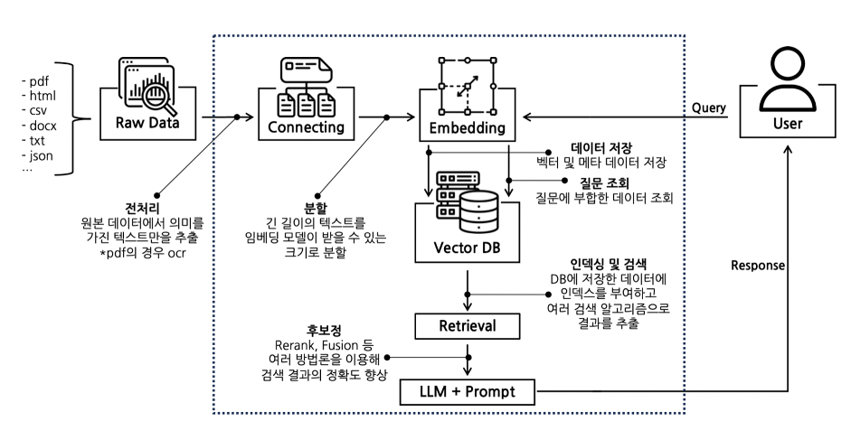

# LLM Service workflow



```txt
서버
1. Raw Data를 저장 (Document Loader, 의미있는 데이터만 수집(전처리))
2. 수집한 데이터를 분할
3. embedding
4. vector store에 저장

클라이언트
1. 쿼리
2. 쿼리를 embedding 하여 vector store에서 검색
3. retriever를 통해서 검색된 결과를 가져옴 (filter, rerank, fusion.. 을 사용)
4. llm에 넣어서 결과를 가져옴
5. 결과를 클라이언트에 반환
```
