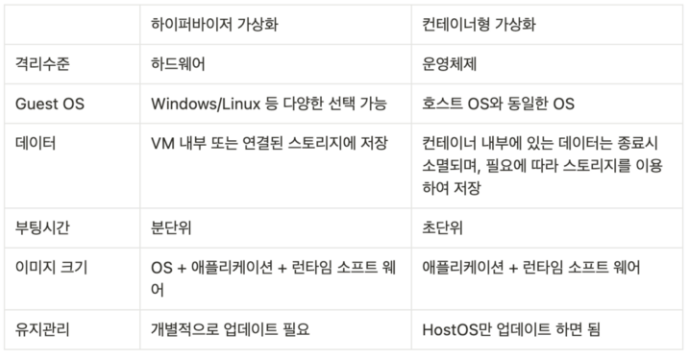

# Docker basic

> 도커 컨테이너는 하드웨어 에뮬레이션 없이 `리눅스 커널`을 공유해서 바로 프로세스를 실행한다.
>
> > Dockerfile -> (build) -> docker_image -> (run) -> docker_container

## 특징

```txt
운영체제 수준의 가상화
빠른 속도와 효율성
높은 이식성(=확장성)
롤백
```



## 명령어

### 기본 명령

```bash
docker ps

docker stop 컨테이너_이름
# 모든 컨테이너 stop
docker stop $(docker ps -a -q)

docker start 컨테이너_이름
docker restart 컨테이너_이름

docker rm 컨테이너_이름
# 실행 중인 컨테이너 삭제
docker rm -f 컨테이너_이름
# 컨테이너 실행이 종료되면 자동 삭제
docker rm --rm 컨테이너_이름

docker rmi 이미지_이름

# 실행중인 컨테이너에 명령어주기
docker exec 컨테이너_이름
# (e.g. docker exec -it mysql mysql -uroot)
# -it 옵션은 터미널과 컨테이너가 지속적으로 연결되도록 하는 옵션

# 컨테이너 명령어 실행
docker exec 컨테이너_이름 /bin/bash

# 접속
docker attach ubuntu

# 파일 옮기기
docker cp 컨테이너_패스 로컬_호스트_패스

# container log 보기
docker logs 컨테이너_이름
```
