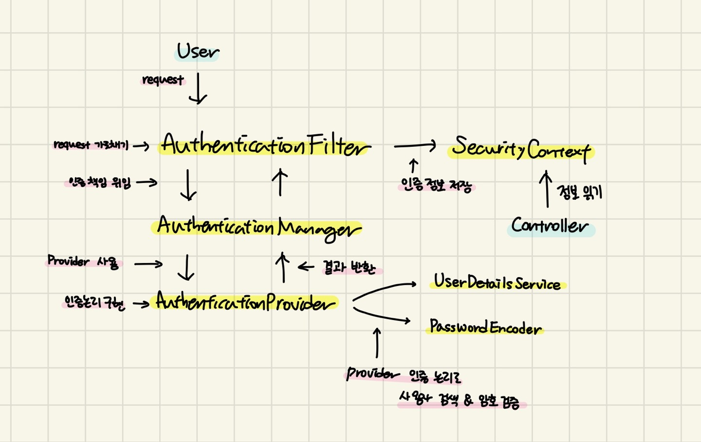

# Spring Security Basic

## UserDetails Interface

> 스프링시큐리티 프레임워크가 이해할 수 있게 사용자를 정의
>
> > 하나 이상의 권한을 갖는다
> >
> > > User.withUsername()을 사용해 빌더형식으로 생성할 수 있다.

## UserDetailsService Interface

> loadUserByUsername() 메소드를 갖는다
>
> > 주어진 사용자 이름으로 사용자 검색
> >
> > > UserDetails 인스턴스 반환

## UserDetailsManager Interface

> UserDetailsService 확장
>
> > create() update() delete() changePassword() UserExists() 메서드 추가
> >
> > > InMemoryUserDetailsManager, JdbcUserDetailsManager

## GrantedAuthority Interface

> UserDetails 인스턴스가 갖는 권한

## PasswordEncoder Interface

> encode(), matches()

## DelegatingPasswordEncoder Interface

> 자격증명 방식을 변경하기 쉽다
>
> > 암호의 접두사를 기준으로 passwordEncoder 구현을 위임
> >
> > > {noop}, {bcrypt}

## KeyGenerator

> 키 생성

## AuthenticationFilter Interface

## AuthenticationManager Interface

## AuthenticationProvider Interface

## SecurityContext Interface
