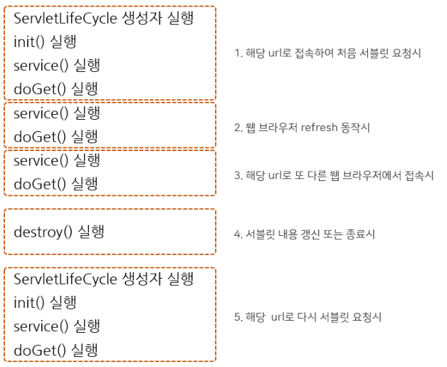

# spring Servlet - 서블릿

> HTTP 프로토콜을 지원하는 _javax.servlet.http.HttpServlet_ 클래스를 상속하여 *서블릿 컨테이너*에 의해서 실행 및 관리
>
> > java 코드다.
> >
> > > 요청마다 *스레드*로써 응답한다.

## 서블릿 컨테이너 (톰캣)

> HTTP 요청을 받아서 서블릿을 실행하고 생명주기를 관리
>
> > 서블릿과 웹서버가 통신할 수 있는 방법을 제공
> >
> > > 멀티 스레딩을 지원, 다중 요청을 처리
> > >
> > > > main() 역할

## 서블릿 동작 매핑 설정

- web.xml

```xml
<servlet>
    <servlet-name>name</servlet-name>
    <servlet-class>com.sb.example</servlet-class>
</servlet>
<servlet-mapping>
    <servlet-name>name</servlet-name>
    <url-pattern>/test</url-pattern>
</servlet-mapping>
```

- java

```java
@WebServlet("/test")
public class ServletClass extends HttpServlet {
    ...
}
```

## 서블릿 생명주기 (Life Cycle)

```java
@WebServlet("/test")
public class LifeCycleServlet extends HttpServlet {
    private static final long serialVersionUID = 1L;
    // 메모리에 없으면 .class 메모리 로딩 -> 디폴트생성자() -> init() 호출
    public void init(ServletConfig config) throws ServletException {
        System.out.println("init called");
        super.init();
    }
    // 메모리에 있는 상태면 각 스레드에서 요청/응답을 처리하고 doGet() or doPost()로 분기된다.
    protected void service(HttpServletRequest request, HttpServletResponse response) throws ServletException, IOException {
        System.out.println("service called");
        super.service(request, response);
    }

    // Get 요청 처리
    protected void doGet(HttpServletRequest request, HttpServletResponse response) throws ServletException, IOException {
        System.out.println("doGet called");
    }

    // Post 요청 처리
    protected void doPost(HttpServletRequest request, HttpServletResponse response) throws ServletException, IOException {
        System.out.println("doPost called");
    }
    // 서블릿을 종료할때 실행
    public void destroy() {
        System.out.println("destroy called");
        super.destroy();
    }
}
```


