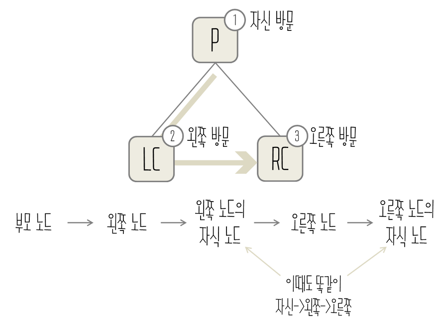
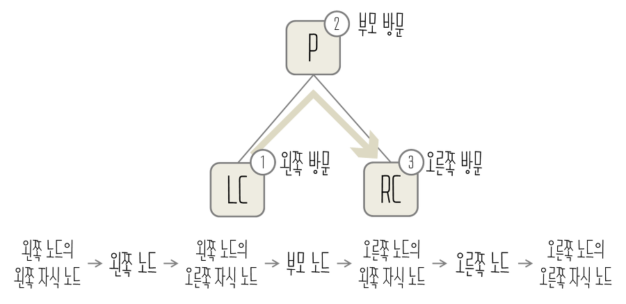
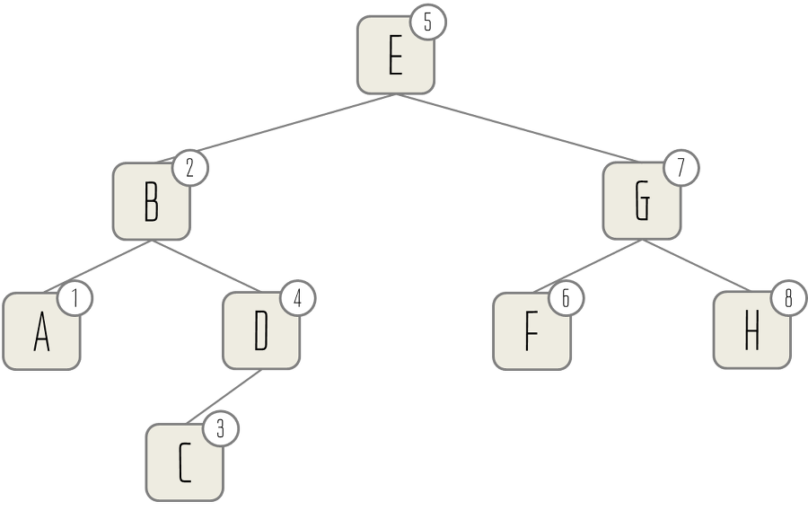
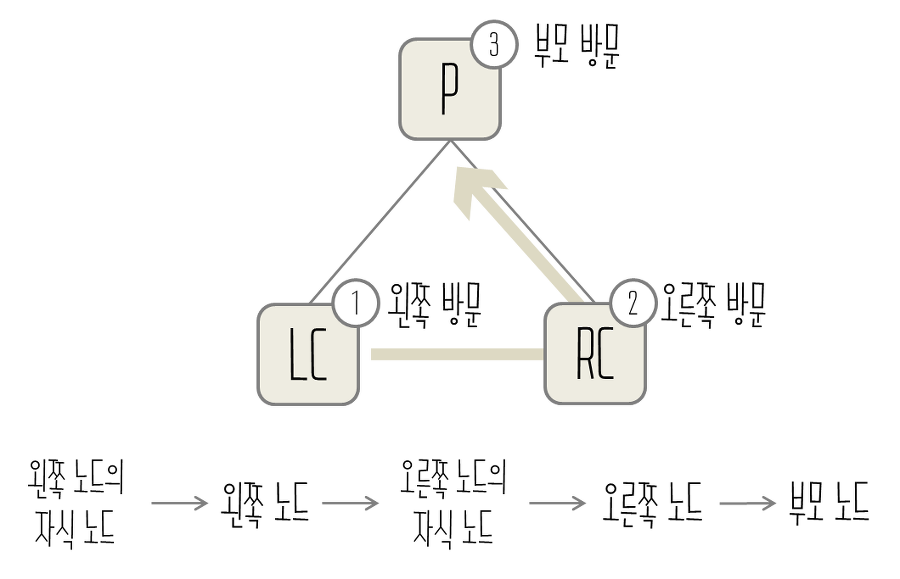
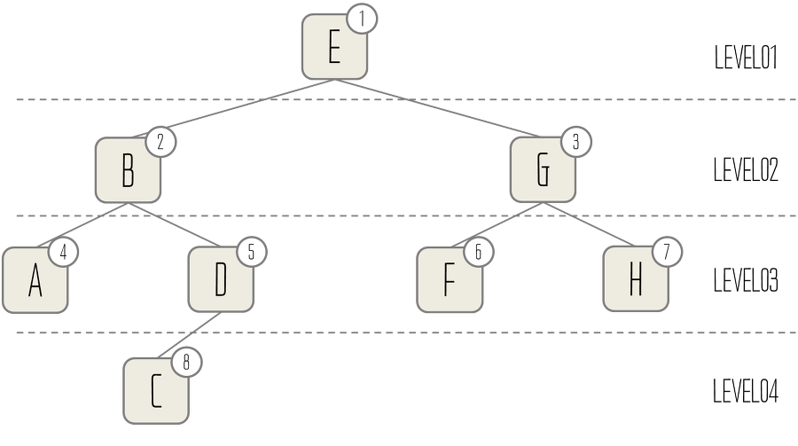

# tree traversal

> 모든 원소를 빠뜨리거나 중복하지 않고 처리하는 연산
>
> > 데이터 검색, 트리 구조 분석, 노드 처리, 트리 출력등의 목적에 따라서 선택
> >
> > > 자식이 먼저 처리되는지 부모가 먼저 처리되는지에 따라서

## 전위 순회 (preorder traversal)




```ts
preorder(callback: any) {
    callback(this.value);
    if (this.left) {
        this.left.preorder(callback);
    }
    if (this.right) {
        this.right.preorder(callback);
    }
}
```

## 중위 순회 (inorder traversal)





```ts
inorder(callback: any) {
    if (this.left) {
        this.left.inorder(callback);
    }
    callback(this.value);
    if (this.right) {
        this.right.inorder(callback);
    }
}
```

## 후위 순회 (postorder traversal)




```ts
postorder(callback: any) {
    if (this.left) {
        this.left.postorder(callback);
    }
    if (this.right) {
        this.right.postorder(callback);
    }
    callback(this.value);
}
```

## 층별 순회 (levelorder traversal)



```ts

```
